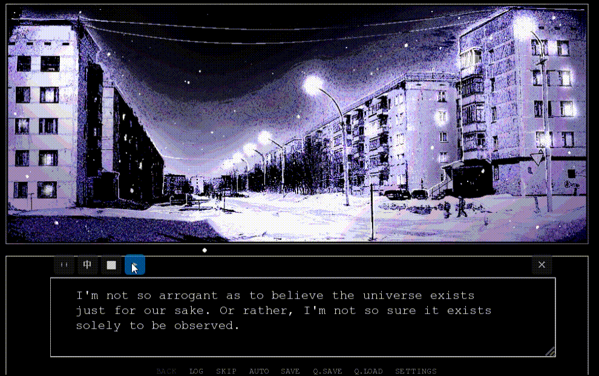

# ScreenTranslate

A floating overlay that OCRs and translates any on-screen text in real time into your chosen language. Drag it anywhere — no screenshots, no copy-paste.

Perfect for untranslated visual novels, games, apps, and any on-screen text.




## Features

- Frameless always-on-top window — drag via `⋮⋮` handle, resize from bottom-right
- Swappable OCR engine for different languages
- Swappable LLM backend (DeepSeek / OpenAI / Ollama / custom compatible APIs)
- Customizable target language
- Shortcuts: `Ctrl+L` toggle, `Escape` clear, `F5` force refresh

## Requirements

- Windows 10+
- Python 3.10+
- CUDA (optional — Florence-2 auto-uses GPU if available)

## Installation

```powershell
python -m venv venv
venv\Scripts\activate
pip install -r requirements.txt
```

## OCR Model

Default engine is **Florence-2-base** (Microsoft lightweight VLM, 0.23B params, ~0.5 GB).

Auto-downloads on first run, or manually:

```powershell
pip install huggingface_hub
huggingface-cli download microsoft/Florence-2-base --local-dir Florence-2-base
```

> **OCR accuracy varies by language.** Florence-2 works well for English. For other languages (Japanese, Korean, Arabic, etc.), use an OCR model optimized for that language.

## Configuration

Edit `config.py` in the project root:

```python
# ── OCR Engine ──
OCR_BACKEND = "src.engine.ocr_florence.FlorenceOCREngine"

# ── LLM Backend ──
LLM_BACKEND = "deepseek"     # deepseek / openai / ollama / custom URL
LLM_API_KEY = "sk-xxxxx"     # API key (not needed for Ollama)
LLM_BASE_URL = ""            # Leave blank for default, or set custom URL
LLM_MODEL = ""               # Leave blank for default, or specify model name
```

### DeepSeek (default)

```python
LLM_BACKEND = "deepseek"
LLM_API_KEY = "sk-xxxxxxxxxxxxxxxxxxxxxxxx"
```

Get a key: [platform.deepseek.com/api_keys](https://platform.deepseek.com/api_keys)

### OpenAI

```python
LLM_BACKEND = "openai"
LLM_API_KEY = "sk-xxxxxxxxxxxxxxxxxxxxxxxx"
LLM_MODEL = "gpt-4o-mini"
```

### Local Model (Ollama)

No internet, completely free.

```powershell
ollama pull qwen2.5:7b
```

```python
LLM_BACKEND = "ollama"
LLM_MODEL = "qwen2.5:7b"
```

### Custom OpenAI-Compatible APIs

vLLM, LocalAI, LiteLLM, one-api, etc.:

```python
LLM_BACKEND = "http://localhost:8000/v1"
LLM_API_KEY = "not-needed"
LLM_MODEL = "qwen2.5-7b-instruct"
```

## Custom OCR Engine

Implement a single method:

```python
class MyEngine(OcrBackend):
    def recognize(self, image_bgr: np.ndarray) -> List[OcrResult]:
        ...
```

Results contain `bbox` (coordinates), `original_text`, and `confidence`.

Point `config.py` to your engine:

```python
OCR_BACKEND = "my_package.my_ocr.MyEngine"
```

Dynamically loaded via `importlib` — no source changes needed.

## Launch

```powershell
python main.py
```

## Usage

1. Drag the window over the text you want to translate
2. Click `▶` or press `Ctrl+L` to start
3. Click the language button to choose your target language
4. Translation starts automatically after the window settles (1 second), with change detection every 1.5 seconds

## Shortcuts

| Shortcut | Action |
|---|---|
| `Ctrl+L` | Toggle translation |
| `Escape` | Clear and re-detect in 1 second |
| `F5` | Force refresh |

## Notes

- Translation API requires internet (except Ollama local models)
- Default OCR model (`Florence-2-base/`) must be downloaded separately
- **OCR quality is language-dependent** — Florence-2 works well for English; use a different engine for other languages
- Close button terminates the process immediately (`os._exit(0)`)
